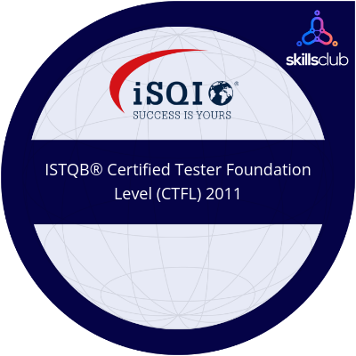
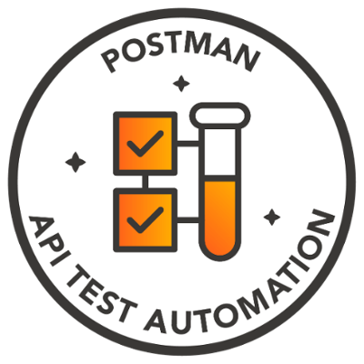
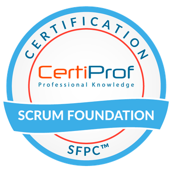
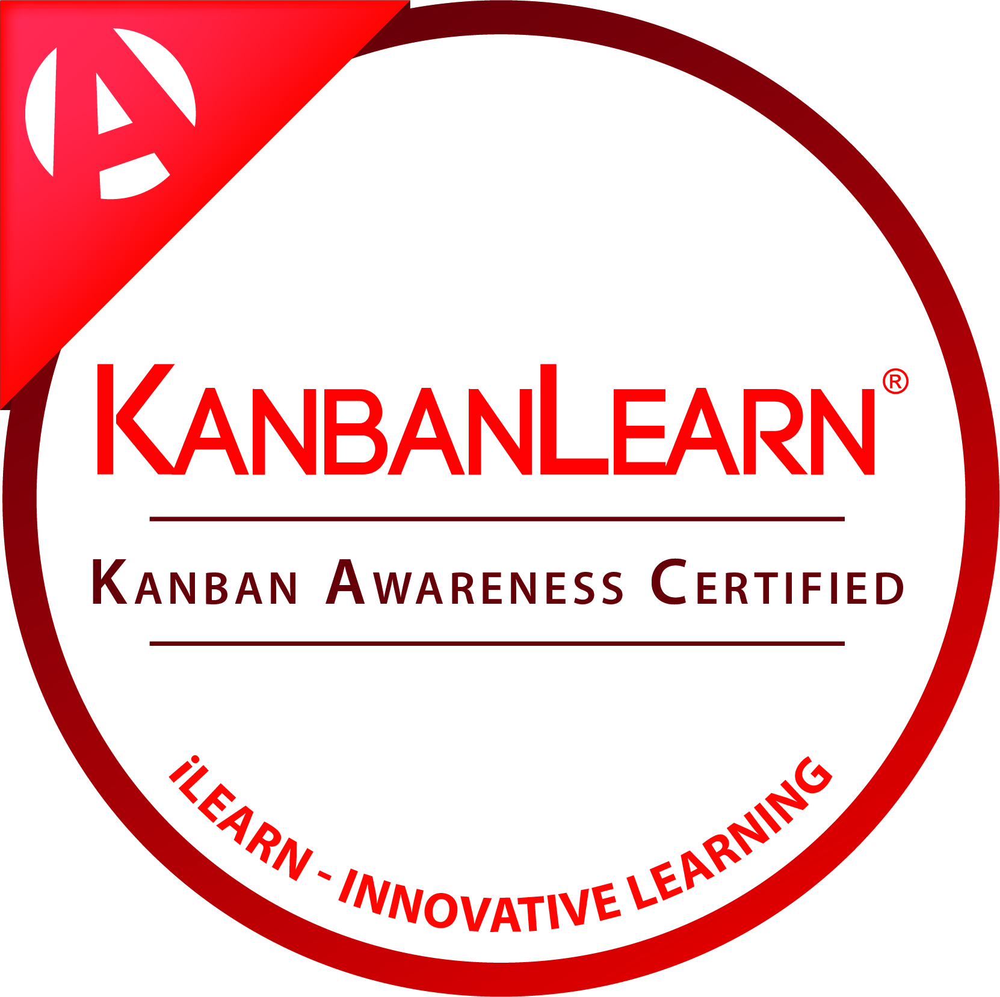

I am Svitlana, ISTQB-certified QA Engineer with over 10 years of experience in quality assurance and software testing for desktop and web-based applications. Adept in both theoretical and practical aspects of software testing, proficient in all stages of software development from requirements analysis to full product implementation and post-release maintenance. Expertise includes analyzing business and technical requirement specifications, designing and executing comprehensive tests, reporting results, and tracking defects using various test management tools.

## My Skills

- **Industry Knowledge:** Functional testing, API Testing, Usability testing, Regression testing, GUI testing, Ad-hoc testing, Exploratory testing, User Acceptance testing, Cross-browser testing, Mobile testing, Black Box testing, Bug Tracking, Requirement Analysis, Test Planning, Test Cases
- **Methodologies:** Scrum, Kanban
- **Languages:** SQL, familiar with HTML, JSON, XML, CSS
- **Databases/Storages:** Microsoft SQL Server, Oracle SQL Developer, PostgreSQL, Azure Storage Explorer
- **Tools:** JIRA, TFS, Azure DevOps, Microsoft Test Manager, Test Link, TestRail, Jenkins, TeamCity, Chrome Dev Tools, Postman, Swagger, Docker, Jmeter
- **Languages:** English (B2), Ukrainian (native)

## Certifications and Achievements

  
  
   
  

## Contact Information

Feel free to reach out to me via [LinkedIn](https://www.linkedin.com/in/svitlana-koshchii-54706187/) or [Email](mailto:svetlana.koshchy@gmail.com).

